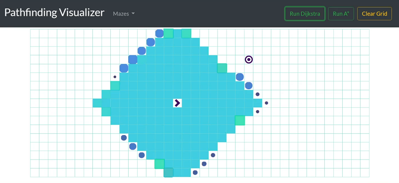

# Pathfinding Visualizer
A visualization tool for pathfinding algorithms.  
Check it out: <a href="https://fadiyousif.github.io/pathfinding-visualizer/" target="_blank">https://fadiyousif.github.io/pathfinding-visualizer/</a>

There is a set of problems in computer science that require us to find the shortest path between a set of points. The applications are numerous and commonplace — from satellite navigation to internet packet routing; even finding the shortest length of wire needed to connect pins on a circuit board is an example of a shortest path problem.

Seeing as this type of problem arises so frequently, there are some standard algorithms that can be used to find a solution. Two of the most popular ones are Dijkstra's algorithm and A*.

__Dijkstra:__ The algorithm's directive is to always evaluate the __unvisited chepeast node__, regardless of the direction or proximity to the target. It starts by initializing the costs of all of the nodes to __infinity__ (except the start node) to show that the cost has not yet been calculated. The costs are updated as shorter paths are found. 
It's worth pointing out that Dijkstra's shortest path algorithm is an example of a _greedy algorithm_. And that's because it's always selecting the unvisited node with the smallest known distance from the start node. The assumption is that if we select the closest one to the start every time, we will get to the target more quickly. With some graphs, this greedy approach is desirable, particularly if we want to find the shortest paths from the start node to all other nodes.

__A*:__ An extension of Dijkstra's algorithm that achieves better performance by using heuristics to guide its search. The heuritistic function provides an __estimate__ of the minimum distance between a given node and the target node. The algorithm combines the __actual cost from the start node__ - referred to as `g(n)` - with the __estimated cost to the target__ - referred to as `h(n)` - and uses the result `f(n) = g(n) + h(n)` to select the next node to evaluate. Each time through the main loop, it examines the node that has the lowest `f(n)` score. The performance and efficiency of A* search algorithm heavily depends on the quality of the heuristic function. It is very important that the heuristic function does not overestimate costs. So long as the heuristic function provides an estimate that is less than or equal to the actual cost, A* will always find an optimal path. One major practical drawback is its space complexity, as it stores all generated nodes in memory. 
